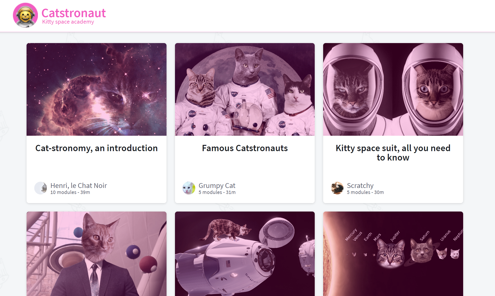

# Resolvers 🚀

Welcome to Resolvers! I built this project to assist with learning GraphQL using [this course](https://odyssey.apollographql.com/lift-off-part2). This project implements a resolver function that connects to a [REST api](https://odyssey-lift-off-rest-api.herokuapp.com).

You can [preview the completed demo app here](https://lift-off-client-demo.netlify.app/).

## How to use this repo

There are 2 main folders:

- `server`: The starting point of my GraphQL server.
- `client`: The starting point of my React application.

To get started:

1. Navigate to the `server` folder.
2. Run `npm install`.
3. Run `npm start`.

This will start the GraphQL API server.

In another Terminal window,

1. Navigate to the `client` folder.
1. Run `npm install`.
1. Run `npm start`.

This will open up `localhost:3000` in your web browser.

